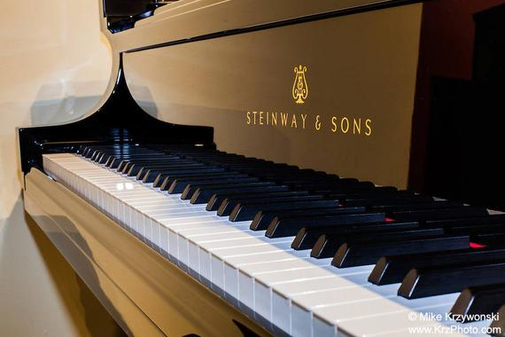
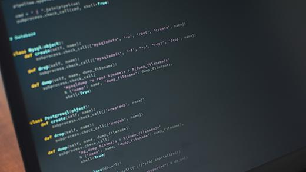

# piano-chords
Using only one hand, how many unique chords can you play on a piano keyboard?

Assumptions
===========

1. Your hand has a span of one octave, from thumb to pinky. When your right thumb is on middle C, your right pinky can just reach high C.
1. Within the span of your hand, your very dexterous fingers can hit any of the keys.
1. Each finger can only press one key at a time.
1. A chord has at least three notes.
1. A 'unique' chord means a unique set of keys on the piano keyboard. A low C major chord and high C major chord involve different keys and count as two unique chords. But alternate fingerings of the same piano keys are not unique chords.

Answer
======

There are 88 keys on a standard piano, and 12 notes in an octave. From this information we can calculate there are **60863** unique chords that can be played with one hand. Don't believe me? If we number the piano keys from 1 to 88, we can make a list of all the unique chords. View the full list here: [unique chords](chords2.md)

Solution 1
==========

![f1]

We can organize all the unique chords into distinct groups according to the lowest note in the chord. The first group contains all the unique chords whose lowest note is key #1 on the piano, the lowest possible note it can play. Because the hand can span a full octave, there are 12 other notes above key #1 that could also be played in order to form a chord. To form a three-note chord, we need key #1 plus any two of those 12 other notes. We can use [Combinations](https://en.wikipedia.org/wiki/Combination) to calculate how many unique possibilities exist. It is C(12,2) which equals 66, so there are 66 possible three-note chords whose lowest note is key #1.

The next group contains all the unique chords whose lowest note is piano key #2. We know that these chords can't also be part of the first group, because none of them include piano key #1, but all of the chords in the first group include key #1. So the two groups of chords are non-overlapping, and we can just add up how many members are in each group.

We can use the same method to count the unique chords in the first 76 groups. Beginning with group 77, we begin to run out of space on the paino keyboard. If the lowest note is key #77, the hand could span 12 notes up to key #89, but there are only 88 keys! So there are actually only 11 other notes above #77 that could also be played in order to form a three-note chord. That's C(11,2) which equals 55.

By the same reasoning, there are C(10,2) unique three-note chords whose lowest note is key #78, C(9,2) for key #79, C(8,2) for key #80... C(2,2) for key #86. We stop there, because it's not possible to form a three-note chord whose lowest note is key #87 or #88.

Adding those all together, we get 76 * C(12,2) + C(11,2) + C(10,2) + C(9,2) + ... + C(3,2) + C(2,2), which equals 5236 possible three-note chords that can be played with one hand.

We can use the same method to calculate the number of unique four-note chords, except the combinations will use C(xx,3) instead of C(xx,2), and we'll stop at key #85. And then use the same method once more for the five-note chords, using C(xx,4) and stopping at key #84.

Add them all together, and you get 60863 unique chords.

Here is a spreadsheet with the calculations: [chords spreadsheet](https://docs.google.com/spreadsheets/d/1tZorBLimERYje6AAHBux1wXnYMuHpflxjamQk8WGPJY/edit?usp=sharing)

Solution 2
==========

We can write a program that enumerates every possible chord, writing it to a list, then count the number of items in the list. This also makes it possible to visually inspect the list of chords to check for any obvious errors, omissions, or duplications.

The program consists of five nested loops, one for each possible note in the chord. The first (outermost) loop enumerates all the possibilities for the lowest note in the chord. It ranges over keys 1 to 88, since the the lowest note could theoretically be anywhere on the piano. The second loop enumerates all the notes that are higher than the first note, but still within a hand span of the first note (and still within the 88 key range of the piano). The third loop enumerates all the notes that are higher than the second note, but still within a hand span of the first note.

Inside the third nested loop, the program has identified a unique three-note chord, so it increments a counter for the total number of 3-note chords. But it doesn't stop there: it continues in the same pattern with a fourth nested loop, and a fifth, to enumerate all the unique 4-note and 5-note chords. 

Run the program, and it lists 60863 unique chords. 

Here is an implementation of the program in Python: [piano-chords.py](piano-chords.py)

[f1]: http://chart.apis.google.com/chart?cht=tx&chl=76\displaystyle\sum_{i=2}^{4}{}_{12}C_{i}%2B\displaystyle\sum_{i=2}^{11}{}_{i}C_{2}%2B\displaystyle\sum_{i=3}^{11}{}_{i}C_{3}%2B\displaystyle\sum_{i=4}^{11}{}_{i}C_{4}
